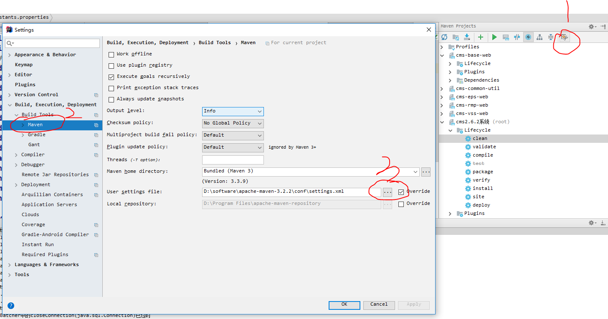

### 流程
1. 更新代码后，使用 `IDEA` 打开，以 `porject` 形式展开
2. 配置 `configurations` 
3. 虚拟机的参数 ``` -Xms1024M -Xmx2048M -XX:PermSize=1024m -XX:MaxPermSize=1024m ```
4. 配置 `maven` 

5. `clean` 项目后，`install` 项目（完成编译）