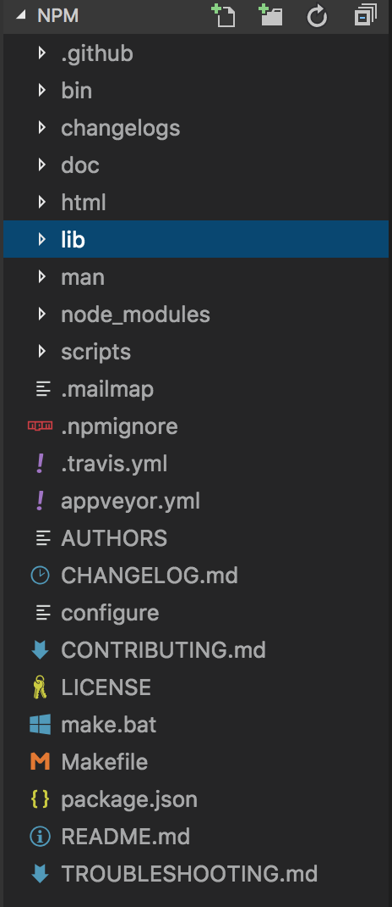

## 起因

开发的过程中，总是会遇到线上环境与线下的包不一致问题。
有时新安装一个包，会发现 `package-lock.json` 也会出现非下载包也跟着变动了。

## 源码

### npm 包结构
1. 查看 `npm root -g` 根目录
2. 打开 npm 模块的包


### 项目分析
1. package.json 中的 main

```
"main": "./lib/npm.js"
```
2. npm.js 结构


3. config/cmd-list.js

4. bin/npm-cli.js

```js
npm.load(conf, function (er) {
if (er) return errorHandler(er)
npm.commands[npm.command](npm.argv, function (err) {
    // https://www.youtube.com/watch?v=7nfPu8qTiQU
    if (!err && npm.config.get('ham-it-up') && !npm.config.get('json') && !npm.config.get('parseable') && npm.command !== 'completion') {
    output('\n 🎵 I Have the Honour to Be Your Obedient Servant,🎵 ~ npm 📜🖋\n')
    }
    errorHandler.apply(this, arguments)
})
})
```

### Installer

即 `install.js` 文件中定义的类。

#### install()


#### Installer()

```js
function Installer (where, dryrun, args) {
  // aproba 是一个轻量级的函数参数校验库。S string, B boolean, A array, Z null, O object
  validate('SBA', arguments)
  this.where = where
  this.dryrun = dryrun
  this.args = args
  // fakechildren are children created from the lockfile and lack relationship data
  // the only exist when the tree does not match the lockfile
  // this is fine when doing full tree installs/updates but not ok when modifying only
  // a few deps via `npm install` or `npm uninstall`.
  this.currentTree = null
  this.idealTree = null
  this.differences = []
  this.todo = []
  this.progress = {}
  this.noPackageJsonOk = !!args.length
  this.topLevelLifecycles = !args.length
  this.dev = npm.config.get('dev') || (!/^prod(uction)?$/.test(npm.config.get('only')) && !npm.config.get('production')) || /^dev(elopment)?$/.test(npm.config.get('only'))
  this.prod = !/^dev(elopment)?$/.test(npm.config.get('only'))
  this.rollback = npm.config.get('rollback')
  this.link = npm.config.get('link')
  this.global = this.where === path.resolve(npm.globalDir, '..')
  this.started = Date.now()
}
```

#### Installer().run()
1. 核心完成两个 `installSteps`, `postInstallSteps` 的收集
2. `chain` 式执行
```js
var chain = require('slide').chain;
```
3. newTracker()
```js
process.emit('time', 'stage:' + name)
```


## 重要属性
1. scope -- '/' 命名空间。最多只有一级
`getProjectScope()` -- 返回 `@name` 
```js

  function scopeifyScope (scope) {
    return (!scope || scope[0] === '@') ? scope : ('@' + scope)
  }

  function getProjectScope (prefix) {
    try {
      var pkg = JSON.parse(fs.readFileSync(path.join(prefix, 'package.json')))
      if (typeof pkg.name !== 'string') return ''
      var sep = pkg.name.indexOf('/')
      if (sep === -1) return ''
      return pkg.name.slice(0, sep)
    } catch (ex) {
      return ''
    }
  }
```

2. 有哪些命令
`npm.js:L118`
```js
var cmd = require(path.join(__dirname, a + '.js'))
```
